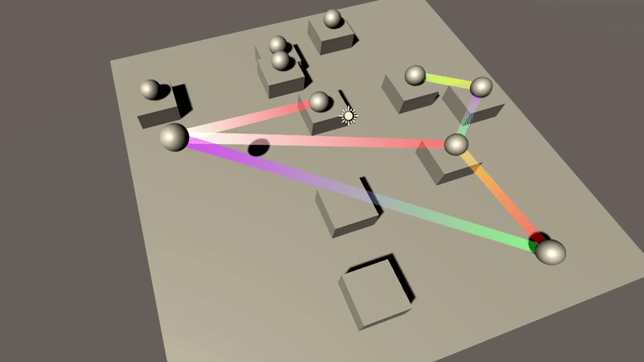
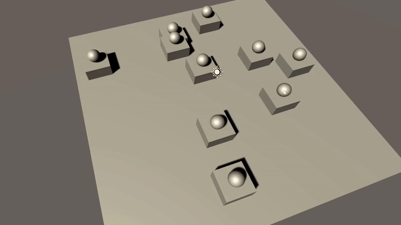
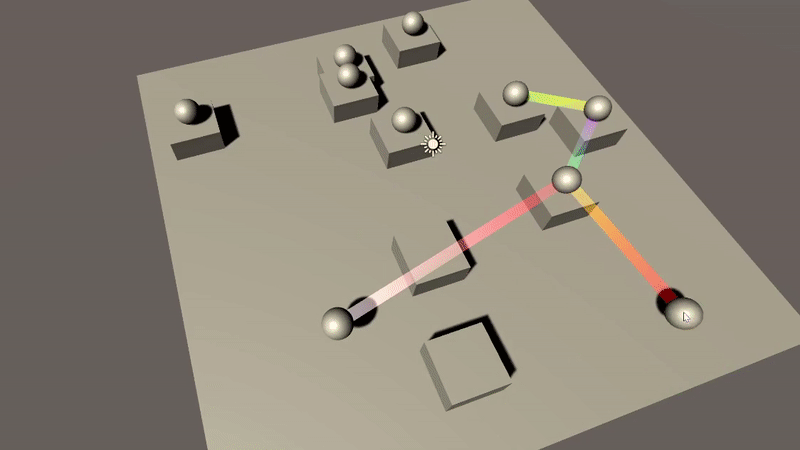
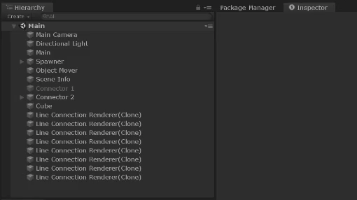
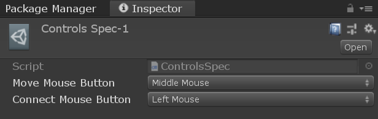
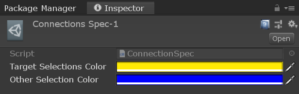
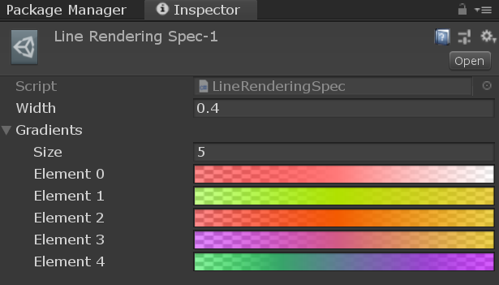
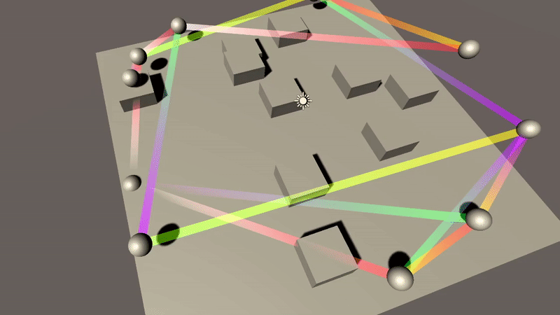

# Test-Connections
Test assignment for job application.

### Core logic.

**Connector Type 1.** \

**Connector Type 2.** \

**Movement with axis locking.** \
It won't break the connections. You can lock the axis on X/Y/Z keyboard keys. \

**Changing the connector.** \
Enabling another connector will disable previous one. \

### You can change the following settings in their 'Specs':
Or create and assign new ones.

**Controlling mouse buttons in `Controls Spec-1.asset`.** \

**Connections selection settings in `Connections Spec-1.asset`.** \

**Line rendering settings in `Line Rendering Spec-1.asset`.** \
Gradient will be chosen randomly for each line. \
 \
For example, changing line width. \
 \
